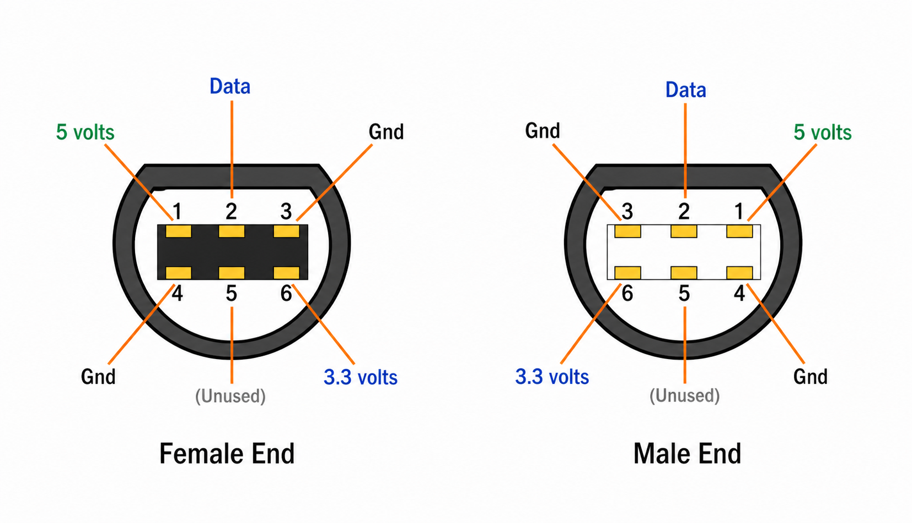
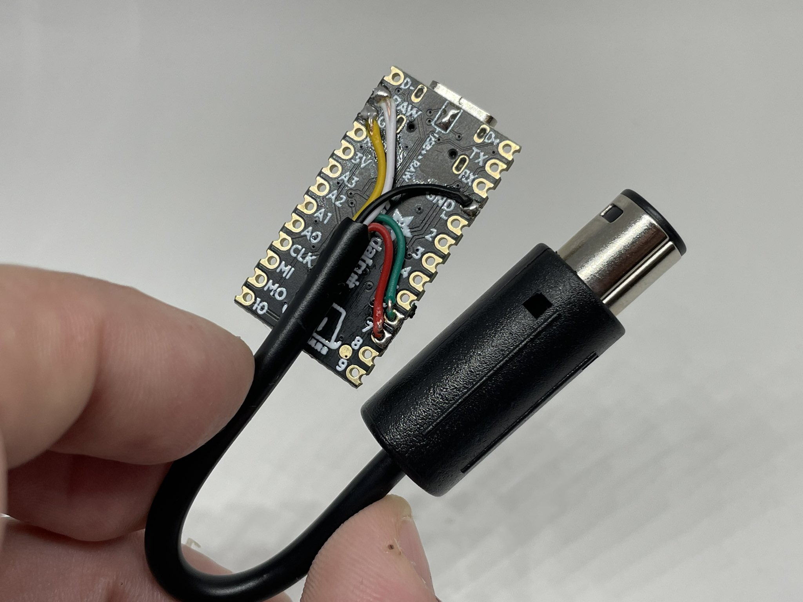
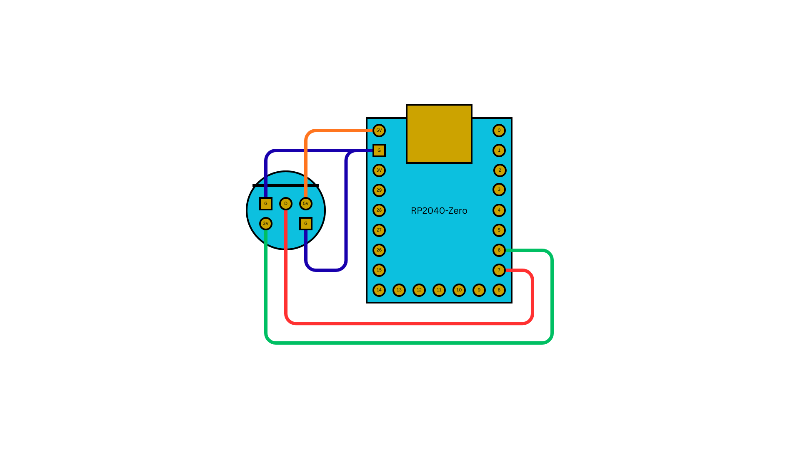

# USB to GameCube Adapter

Build a USB/Bluetooth-to-GameCube adapter on an RP2040 board. The wiring is identical across the supported boards — only the build target and a couple of pad labels change.

## Supported Boards

| Board | Build Target | 5V Pin Label | Notes |
|-------|--------------|--------------|-------|
| Adafruit KB2040 | `usb2gc_kb2040` | RAW | Bridge USB power pads (see [Controller Input](#controller-input)) |
| Raspberry Pi Pico | `usb2gc_kb2040` | VBUS | No onboard NeoPixel — controller status only via flash |
| Waveshare RP2040-Zero | `usb2gc_rp2040zero` | 5V | NeoPixel on GPIO 16; I2C remapped to GPIO 14/15 |

The Pi Pico runs the same firmware as the KB2040 — same RP2040 chip, same default GPIO map.

## Parts Needed

- One of the boards above
- GameCube controller extension cable (cut to expose the five wires inside)
- USB-A female to USB-C male adapter (KB2040) or USB-A to micro-USB OTG adapter (Pi Pico) so USB controllers can plug into the board's host port
- Soldering iron and solder

## Wiring

### GameCube Connector

The GameCube controller port uses a proprietary connector. Cut a GC extension cable and wire the console-end plug to your board.



| GC Pin | Signal | RP2040 GPIO | Notes |
|--------|--------|-------------|-------|
| 1 | 5V | RAW (KB2040) / VBUS (Pico) / 5V (RP2040-Zero) | Powers the board from the console |
| 6 | 3.3V | GPIO 6 | Console-presence sense — distinguishes "plugged into a GameCube" from "powered over USB only" |
| 2 | Data | GPIO 7 | Bidirectional joybus data line |
| 3, 4 | GND | GND | Tie both GC ground wires to the board's GND |
| 5 | (unused) | — | Leave disconnected |

Cable wire colors vary by manufacturer — verify with a multimeter against the [GameCube Pinout reference](../../output/gamecube.md) before soldering.

When no console is detected (USB-only power), the adapter boots into USB device + CDC config mode so you can plug it into a computer for setup. With the console connected and powering the 3.3V sense line, the adapter runs in play mode as a GameCube controller.

!!! warning "Don't power the adapter from both ends at once"
    The GameCube cable's 5V wire connects to the board's 5V/RAW/VBUS rail, which is the same rail as USB-C/microUSB VBUS through the board's protection diode. Plugging the adapter into a console **and** a computer's USB port at the same time ties two 5V supplies together — you can backfeed one into the other and stress the regulators on either side. Use the console's power for play mode, or USB power for config mode, never both.

### Controller Input

The board's native USB port is the host. Plug your USB controller into it through a USB-A female adapter (USB-C for KB2040, micro-USB OTG for Pi Pico, USB-C for RP2040-Zero) — no GPIO wiring is needed for the host side. The joybus PIO program would clash with PIO-USB on RP2040, so this build deliberately uses the native USB controller for input and reserves PIO entirely for the GameCube data line.

!!! note "KB2040: bridge the USB power jumper"
    On the KB2040, bridge the solder pads on the underside next to the USB-C port to enable full USB host power. Without the bridge, attached controllers may not get enough current to enumerate or run rumble. Pi Pico and RP2040-Zero have this routed by default and need no jumper.

For Bluetooth controllers, none of these boards have an onboard radio — plug a [compatible USB BT dongle](../../input/bluetooth.md#bluetooth-dongles) into the host port (use a USB hub if you also need a wired controller alongside).

## Reference Builds

### KB2040

A finished KB2040 + GC cable build — five wires from the cable land on RAW (5V), GPIO 6 (3.3V sense), GPIO 7 (data), and a pair of GND pads:



### RP2040-Zero

Same wiring on a Waveshare RP2040-Zero — only the physical pad locations and the NeoPixel/I2C settings change, the GC pins are identical:



## Build and Flash

```bash
# KB2040 (also use this target on Pi Pico)
make usb2gc_kb2040
make flash-usb2gc_kb2040

# RP2040-Zero
make usb2gc_rp2040zero
make flash-usb2gc_rp2040zero
```

Flash by holding the BOOT button while connecting USB (or double-tap reset on boards that support it) to mount the `RPI-RP2` drive, then drag-and-drop the `.uf2`. Output files:

- `releases/joypad_<commit>_usb2gc_kb2040.uf2`
- `releases/joypad_<commit>_usb2gc_rp2040zero.uf2`

## Testing

1. Connect the GC cable to a GameCube or Wii console
2. Plug a USB controller into the board's host port (through your USB-A adapter)
3. The NeoPixel LED should turn solid purple (1 controller connected) — Pi Pico has no NeoPixel, so skip this step
4. Press a button on the controller — the GameCube should register input
5. Verify analog sticks, triggers, and rumble feedback

## Important Notes

- The RP2040 runs at **130 MHz** (overclocked from 125 MHz) for precise joybus timing
- All USB inputs are merged to a single GC output (MERGE_BLEND mode)
- Profile cycling: hold SELECT + D-pad Up/Down for 2 seconds
- See [usb2gc app docs](../../apps/usb2gc.md) for profiles, keyboard mode, and feature details
